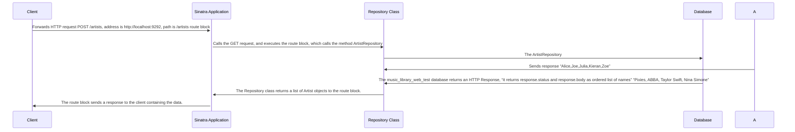

-- 1 The client sends a HTTP request to the web server over the Internet: GET /albums
-- 2 The web server (a Sinatra application, in our case) handles the request, and executes the route block, which calls the method AlbumRepository#all
-- 3 The Repository class runs a SQL query to the database.
-- 4 The database returns a result set to the program.
-- 5 The Repository class returns a list of Album objects to the route block.
-- 6 The route block sends a response to the client containing the data.
-- 7 The flow described above is what most CRUD web applications will implement, so it is important to get familiar with it, and to have a good mental model on how it works.