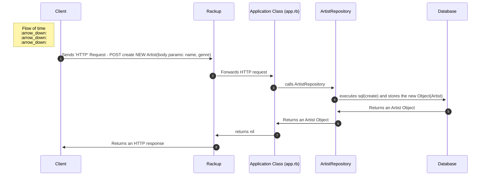

```mermaid
sequenceDiagram
autonumber
  participant C as Client
  participant R as Rackup
  participant A as Application Class (app.rb)
  participant AR as ArtistRepository
  participant D as Database
  Note left of C: Flow of time <br /> :arrow_down: <br /> :arrow_down: <br /> :arrow_down:
  C->>+R: Sends 'HTTP' Request - POST create NEW Artist(body params: name, genre)
  rect rgb(700, 404, 555)
  R->>+A: Forwards HTTP request
  A->>+AR: calls ArtistRepository
  AR->>+D: executes sql(create) and stores the new Object(Artist)
  D->>+AR: Returns an Artist Object
  AR->>+A: Returns an Artist Object
  A->>+R: returns nil
  R->>+C: Returns an HTTP response
  end
```